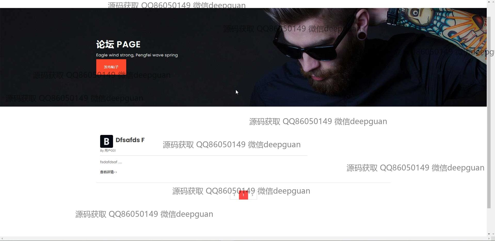
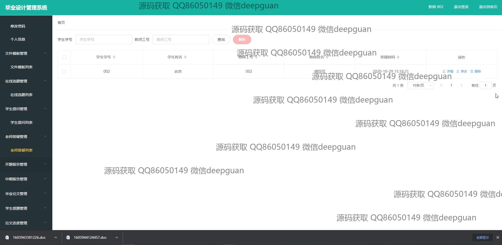

<h1 align="center">的毕业设计选题管理系统vue</h1>

## 简介
毕业设计选题管理系统：角色分为学生、教师和管理员；包括注册登录、题目发布与管理、开题报告、在线选题、文件模板管理、学生提问管理、教师答疑管理等功能。    --计算机毕业设计源码；毕设源码；java毕业设计源码

## 联系方式

<h3 align="center">获取完整代码与数据库文件 + 微信：deepguan QQ: 86050149 QQ群: 783742310</h3>

<h3 align="center">可帮忙远程部署 包运行成功！提供远程部署、修改代码、设计文档指导、代码讲解等服务！</h3>

## 功能介绍（完整见运行截图）
管理员：登录、注册、退出功能，管理学生和教师账户，提供学生和教师信息的查看与修改，支持在线选题管理、文件模板管理、论坛管理、题目审核和报告管理，具备系统设置及权限管理功能，能够对选题和报告进行审核、编辑、删除等操作。

教师：登录、注册功能，个人中心提供账户信息的查看与修改，能够创建和发布选题，管理学生提问，答复学生问题，审核学生的开题报告、选题和中期报告，支持通过富文本编辑器撰写或编辑报告内容，便捷管理毕业设计过程的任务和文档。

学生：登录、注册功能，个人中心支持查看和修改个人信息，能够注册并选择毕业设计题目，填写开题报告、中期报告和论文内容，在线提问教师并获取指导，支持上传文件及通过富文本编辑器撰写报告，实时查看选题和报告的审核状态。

访客：访问登录页面，注册学生或教师账户，浏览新闻资讯模块和论坛页面，查看系统功能模块的简要说明和轮播图展示内容，无法使用高级权限操作，仅能完成注册或登录操作后进入系统。

## 运行截图

本代码来源于网络,仅供学习参考使用!

